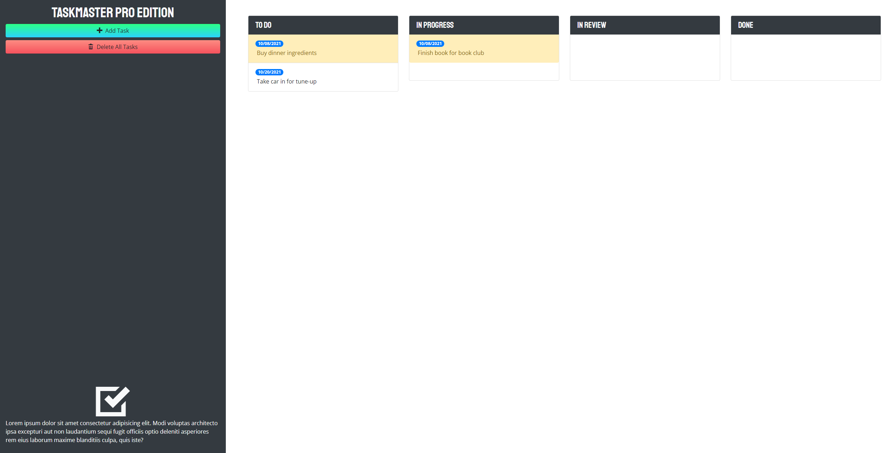

# Taskmaster Pro

## Description

This repository is an exercise in writing an interactive Kanban task-tracking board using libraries and frameworks provided by third-party APIs, namely jQuery, jQuery UI, Bootstrap, Google Fonts, Open Iconic, and Moment.js.

To guide development of this project, I utilized the following User Story and Acceptance Criteria.

## User Story

```
AS AN employee with time-sensitive tasks
I WANT to create and organize tasks according to their working status and see which tasks are upcoming or overdue
SO THAT I can efficiently allocate my time and energy and ensure tasks are completed on time.
```

## Acceptance Criteria

```
GIVEN I need to organize my tasks
WHEN I click "Add Task"
THEN I am able to create a new task and set a due date using a calendar/date-picker element
WHEN I click "Delete All Tasks"
THEN All currently stored tasks are removed
WHEN I click on an existing task's name or due date
THEN I can edit the name or due date "in-line"
WHEN I click and hold a task card
THEN I can drag the task card to a new status column or position in the same status column
WHEN I drag a task card
THEN Droppable locations are highlighted/made visible
WHEN I drag the task card to the trash bin
THEN The task is removed
WHEN I hover over button elements
THEN the styling should change to reflect that I'm hovering
WHEN I resize the page or view the site on various screens and devices
THEN I am presented with a responsive layout that adapts to my viewport
```

## Built With

* HTML
* CSS
* JavaScript
* jQuery
* jQuery UI
* Bootstrap
* Moment.js

## Website

<https://thorulfr.github.io/taskmaster-pro/>

## Screenshot



## Contribution

Code by Benjamin Holt
